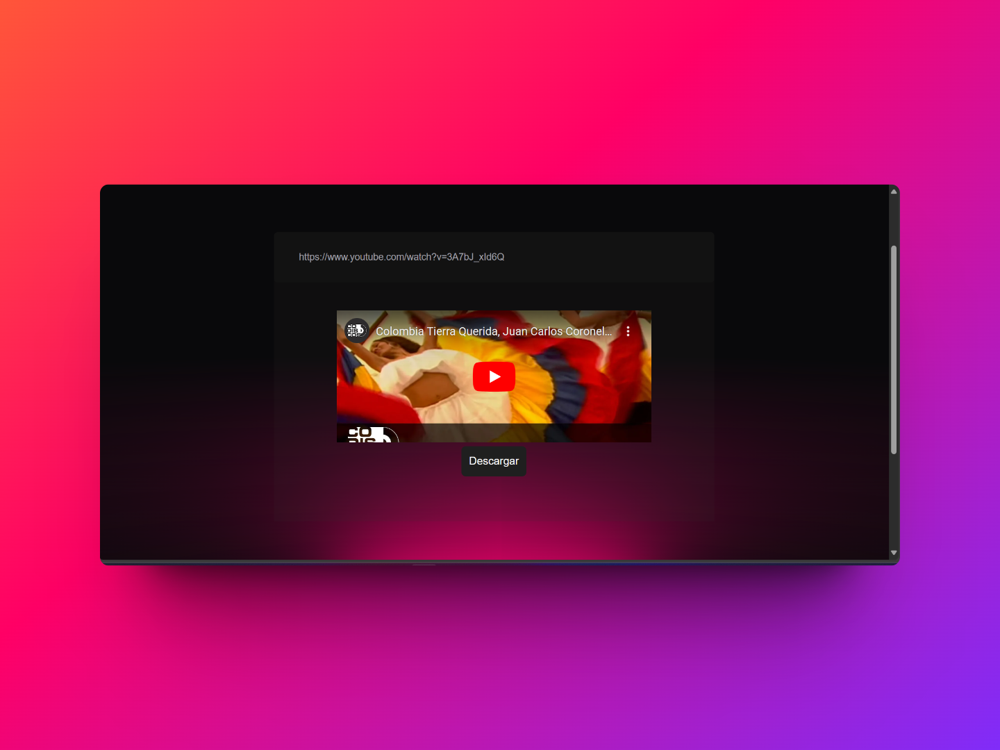

# Convertidor de Videos en Línea 🎥💻

Bienvenido al Convertidor de Videos en Línea. Este proyecto está diseñado para proporcionar una plataforma web simple y conveniente para convertir videos de diferentes formatos en línea.

## Descripción

El Convertidor de Videos en Línea permite a los usuarios cargar videos en varios formatos y convertirlos fácilmente a otros formatos compatibles. Actualmente, el proyecto se encuentra en desarrollo y aún no se ha completado.

## Funcionalidades

- Conversión de videos a formatos populares como MP4, AVI, MKV, etc.
- Carga de videos desde el dispositivo local.
- Interfaz de usuario intuitiva y fácil de usar.

## Estado del Proyecto

🚧 **Aviso: Este proyecto está en desarrollo y aún no se ha completado.** 🚧

Actualmente, estoy trabajando en implementar todas las funcionalidades planificadas y mejorar la experiencia del usuario. ¡Mantente atento a las actualizaciones!

## Contribuciones

¡Las contribuciones son bienvenidas! Si deseas contribuir al proyecto, por favor consulta nuestra guía de contribución para obtener más información sobre cómo comenzar.

## ¡Gracias por tu interés en el proyecto!

## Diseño

## mode claro

# modo oscuro

# carga de video

## ESTE PROYECTO ESTA EN DESARROLLO